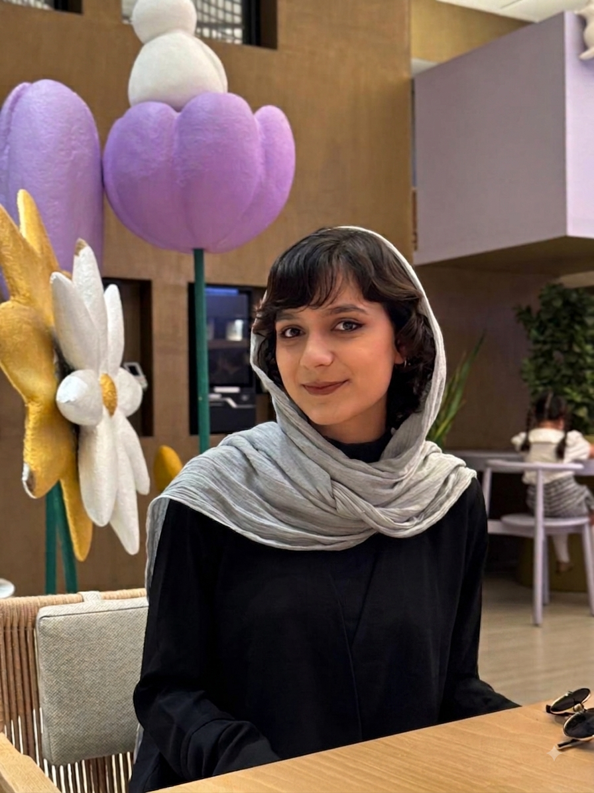
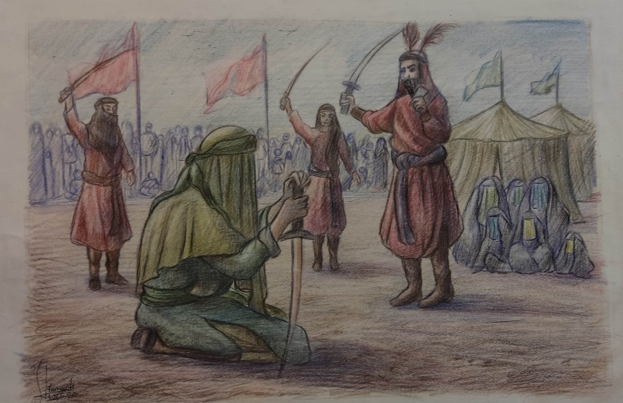
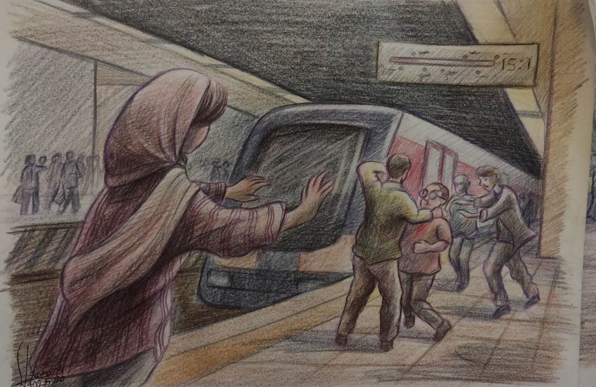

<!DOCTYPE html>
<html lang="fa" dir="rtl">
<head>
<meta charset="UTF-8">
<meta name="viewport" content="width=device-width, initial-scale=1.0">
<title>دوره آموزشی طراحی ویژه آزمون عملی | فرنوش صمدی</title>

<link href="https://cdnjs.cloudflare.com/ajax/libs/font-awesome/6.0.0/css/all.min.css" rel="stylesheet">

</head>
<body class="antialiased selection:bg-accent selection:text-white">

<header class="relative min-h-screen flex flex-col items-center justify-center p-6 md:p-12 overflow-hidden">
  

    

      ویژه آزمون عملی هنر
      <h1 class="text-5xl md:text-7xl font-bold leading-tight mb-6">دوره طراحی</h1>
      

        مدرس: فرنوش صمدی 
        (دانشجوی نقاشی دانشکدگان هنرهای زیبای دانشگاه تهران)
      

    

    

      

      <!-- Profile Picture -->
      
    

  

</header>

<section id="contact" class="py-24 px-6 md:px-12 bg-[#2d2542]">
  

    

      <h2 class="text-4xl font-bold mb-8">ارتباط و ثبت‌نام</h2>
      

        

          <i class="fab fa-telegram text-3xl text-blue-400"></i>
          

            
آیدی تلگرام مدرس:

            <a href="https://t.me/farnoush_samadi" target="_blank" dir="ltr" class="font-bold text-lg hover:text-accent">@farnoush_samadi</a>
          

        

        

          <i class="fas fa-bullhorn text-3xl text-accent"></i>
          

            
کانال تلگرام:

            <a href="https://t.me/azmonamaliehonar" target="_blank" dir="ltr" class="font-bold text-lg hover:text-accent">@azmonamaliehonar</a>
          

        

      

    

    
    

      <h3 class="text-2xl font-bold mb-6 text-center md:text-right">گالری آثار</h3>
      

        <!-- Gallery Images -->
        
        
        
        
      

    

  

</section>

<footer class="border-t border-gray-700 py-8 text-center text-gray-500 text-sm mt-12">
  
تمامی حقوق برای مدرس دوره، فرنوش صمدی محفوظ است. ۱۴۰۳ ©

</footer>

</body>
</html>
